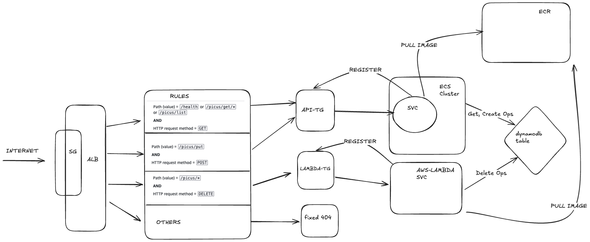

# Application
This application includes an api built with Fiber framework and a lambda function build with aws-lambda-go-sdk. Project structure is following standart go project layout and clean architecture principles as much as possible for a small project.

```
To build go executable for api run:

```bash
cd app
CGO_ENABLED=0 GOOS=linux GOARCH=amd64 go build -o server ./app/cmd/server
```

To build go executable for lambda run:
```bash
cd app
CGO_ENABLED=0 GOOS=linux GOARCH=amd64 go build -o main ./app/cmd/lambda
```

There is two Dockerfile in the app directory, images are optimized to be as small as possible.
- Dockerfile is for building api container image, which uses alpine as base image.
- Dockerfile.lambda is for building lambda container image, which uses amazonlinux as base image.

## Configuration

Configurations are kept under `.conf` directory. Application uses viper package for configuration management. There is only one environment variable `APP_ENV` which is used to determine which configuration file to use. If `APP_ENV` is not set, application sets it to `local` by default. For example if `APP_ENV` is set to `prod`, application will use `.conf/prod.yaml` file.

## Api Specification

```http
GET /picus/list
```

Example Response:
```json
[
    {
        "data": {
            "age": 29,
            "city": "Denizli",
            "name": "Yasin AHLATCI"
        },
        "objectID": "bb71d6fa-756e-4e49-91ff-abb88e948c8e"
    },
    {
        "data": {
            "age": 29,
            "city": "Istanbul",
            "name": "Yasin",
            "surname": "AHLATCI"
        },
        "objectID": "f6bb4939-1271-4911-b337-8b65096890b3"
    }
]
```

```http
GET /picus/get/{id}
```

Example Response:
```json
{
    "age": 29,
    "city": "Denizli",
    "name": "Yasin AHLATCI"
}
```

```http
POST /picus/put
Body: 
{
    "data": {
        "age": 29,
        "city": "Denizli",
        "name": "Yasin AHLATCI"
    }
}
```

Example Response:
```json
{
    "objectID": "generated-uuid-here"
}
```
## Lambda Specification

```http
DELETE /picus/{objectID}
```

Example Response:
```json
{
    "message": "Item deleted successfully",
    "success": true
}
```

# Infrastructure
The infrastructure for this project is managed using Terraform. It includes the following components:
- Vpc
- ECS Cluster
- Ecs Service
- Ecr Repository
- Application Load Balancer (ALB)
- DynamoDB Table
- Lambda Function
- Security Groups
- IAM Roles and Policies
- S3 ( Remote State )

Infrastructure is created with this order:
1. VPC
2. ECS Cluster
3. ECR Repository
4. DynamoDB Table
5. IAM Roles and Policies
6. ALB
7. ECS Service
8. Lambda Function



### IAM Roles and Policies
Applications have their own spesific roles and policies. This way we follow the principle of least privilege. Terraform files are located in:
- `infrastructure/iam/sre-case-study-api`
- `infrastructure/iam/sre-case-study-lambda`
There is also seperate For github-actions have a seperate role with greater permissions, because it needs to create resources all around AWS. Github actions role uses OIDC for authentication. This way we only need to give github actions the permissions we want without sharing long lived credentials. Terraform files are located in:
- `infrastructure/iam/sre-case-study-github-actions`

# CI/CD
The CI/CD pipeline is implemented using GitHub Actions. The pipeline includes the following steps:
- Test
- Go Build
- Docker Build and Push
- Deploy

Depyloyments are managed using terraform. In pipelines we update the image tag with the variable `TF_VAR_image_tag` that is set to the current git sha. After the deployment we verify the deployment by waiting for the service to be stable in ECS and checking the image tag of Lambda function.

Go modules are cached between builds to speed up the build process.

Deploy steps are waiting for both of the docker images to be pushed to ECR. This is intentional to make sure that both services are deployed at the same time ( more or less ) to avoid any incompatibility issues.